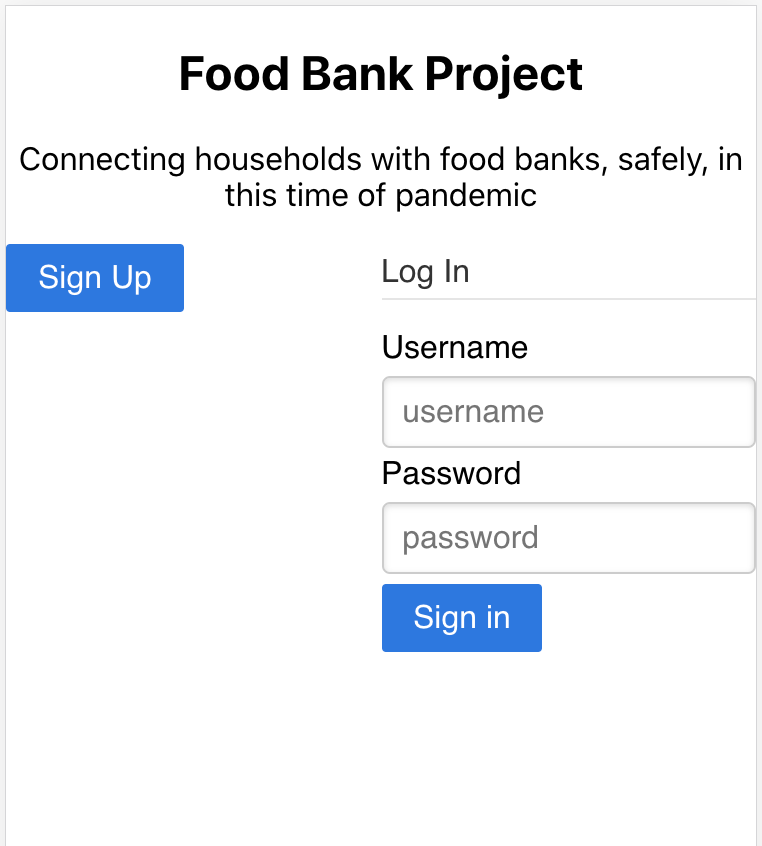

# Food Bank Project

The Food Bank Project is a mobile-first app that implements a paperless registration process for mobile food pantries.

### Purpose

Food banks have responded to increased demand by serving clients through drive-up mobile sites: people who need food can drive to a particular location, where workers and volunteers will load bagged groceries into their backseats or trunks.

As drivers arrive at these sites, they provide some basic information: their name, address, and number of people in their household. In many cases, this means a driver fills out a paper form, or signs a shared check-in sheet, then hands that paperwork to a volunteer.

The Food Bank Project app implements a paperless registration process, both for the sake of efficiency and to limit exposure between clients and pantry workers and volunteers.

### User Story

As a manager of a food pantry, I want to provide workers and volunteers with a means for collecting information outside of paper forms, so that pantry sites can serve clients as quickly as possible and so that I can help to minimize my workers’ exposure to COVID-19. 

### How to Use

For clients:
- For a new client
-- From the home screen, click the 'Sign Up' button
-- Create your login credentials using your email address and a password that you select
-- Enter your personal information: name, address, number of people in your household, and license plate
-- Review your personal information. If you need to make any changes, click the 'Edit' button

- For an existing client
-- From the home screen, enter your login credentials, then click the 'Sign In' button
-- Review your personal information. If you need to make any changes, click the 'Edit' button

For a pantry worker or volunteer, at a mobile pantry:
- From the home screen, enter your login credentials, then click the 'Sign In' button
- As a car approaches at a mobile pantry, enter the car's license plate number
- Review the client's information
-- If you need to make any changes, click the 'Edit Info' link
-- If everything looks okay, click the 'Sign for Client' button
-- Click the 'Enter another license plate number' button

https://github.com/davidcbalsley/final-project

https://food-bank-project.herokuapp.com/
